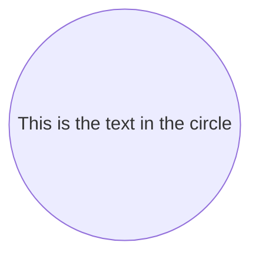

# smartdown

> smartdown - A Javascript library for translating, rendering, and interacting with Smartdown documents.

Smartdown is a *declarative*, *literate* and *reactive* authoring technology for writing technical and non-technical documents that are compelling and easy to share and publish within many existing forums and blogging systems. Smartdown is designed for blogging, technical communication, and teaching. Smartdown simplifies the creation of *Explorable Explanations*, which are prose documents with embedded interactive content such as charts, graphs, and featherweight programs called *playables*.

Smartdown extends the simple expressivity of the [Markdown](https://en.wikipedia.org/wiki/Markdown) language commonly used on blogs, messaging systems, technical forums, and on [GitHub](https://help.github.com/articles/basic-writing-and-formatting-syntax/). The Smartdown **engine** is a Javascript library that interprets the content in these Smartdown source files and enacts the desired behavior and presentation.

- [Smartdown Documentation](https://smartdown.github.io/smartdown/doc/)
- [Smartdown API](https://smartdown.github.io/smartdown/doc/api/)
- [Version History](https://smartdown.github.io/smartdown/doc/versions/)
- [License](https://smartdown.github.io/smartdown/doc/license/)
- [Contributing](https://smartdown.github.io/smartdown/doc/contributing/)
- [Code of Conduct](https://smartdown.github.io/smartdown/doc/code_of_conduct/)
- [Smartdown Source](https://github.com/smartdown/smartdown/)


## Markdown and Smartdown

[Markdown](https://en.wikipedia.org/wiki/Markdown) is an easy-to-learn set of conventions for annotating text for structure and formatting purposes. Markdown embraces the simple principle that the information in a document should be *readable by default*, and that any additional formatting syntax should be unobtrusive to this readability. Smartdown extends Markdown with additional media and content types for enhanced expressivity, and adds its own features including *cells*, *playables*, and *reactivity*.

I think that this principle is important when teaching students (of any age) how to present their ideas and eventually, to visualize their ideas. Unlike HTML and other syntax-restrictive media, Markdown enables an idea to be expressed in a crude form, and then iteratively refined into an ever-better expression of the idea. Sometimes that is simply a blog post with nicely formatted text and embedded graphics. Sometimes it might be an interactive webpage with P5JS or D3 graphics, an Explorable Explanation.

There are several variants of the original Markdown language; Smartdown adopts the GitHub-flavored Markdown variant as its base language. The basic elements of most Markdown implementations are described in this [Markdown Cheatsheet](https://github.com/adam-p/markdown-here/wiki/Markdown-Cheatsheet).

### Smartdown Cells

Smartdown utilizes Markdown's link syntax and if it detects a Smartdown-formatted link, it replaces the link with a Smartdown *cell*, which can act as input, output, computation and more. A subset of the currently valid Smartdown cell types is below:

- Tunnels: `[Link Label](:@Location)`
- Input Cells: `[Input Label](:?VarName)`
- Output Cells: `[Output Label](:!VarName)`
- Calculation Cells: `[Calculation Label](:=Expression)`
- Checkbox Cells: `[Checkbox Label](:XVarName)`
- Tweet: ``
- Tweet+: ``

See [Cells](https://smartdown.github.io/smartdown/#Cells) for detailed examples of Smartdown Cells.

### Smartdown Playables

Smartdown extends Markdown's idea of *code blocks* with the option of making such code *playable*. For example, the code for a [Mermaid](https://mermaidjs.github.io) diagram can be displayed normally using a code block; however, by using Smartdown's `/playable` qualifier, the code can be executed and rendered within the document via the Smartdown-generated Play/Pause buttons:

````markdown

````

There is also an `/autoplay` option, which will ensure that the playable content is executed when the Smartdown card is loaded. These two options may be combined to produced autoplay content that may be manually played and paused. The use of `/autoplay` without a corresponding `/playable` will result in a playable that cannot be paused or its source displayed, which is often useful.

## Philosophy

[Smartdown](https://smartdown.io) is a flexible system for authoring and interacting with [Explorable explanations](https://medium.com/@Max_Goldstein/exploring-explorable-explanations-92f865c8d6ba#.10uo10u6k), which are *micro-apps* composed of text, multimedia and code. Smartdown projects are written using an enhanced version of Markdown called **Smartdown**, which integrates MarkDown's ease-of-use with a reactive process engine.

Users of this technology include teachers, students, bloggers, and anyone who wants to easily create and publish their ideas, research, questions or explanations. The mission of Smartdown is to nurture idea inspiration, simplify the process of creation, and to encourage sharing and exploration of the resulting knowledge.

Smartdown is intended for teacher and student alike; the philosophy being that the best ways to learn a skill or concept are to **use it** and to **teach it**. A teacher might produce a Smartdown project for the purposes of teaching, and may then assign a student the task of *explaining* a learned concept by authoring their own project, which can then be shared (*show and tell* is a powerful technique).

## Ways to Share and Publish Smartdown

The [Smartdown](https://github.com/smartdown) GitHub organization contains several tools, integrations and example applications to illustrate Smartdown usage:

- [smartdown/viewer](https://github.com/smartdown/viewer), a web application that displays the Smartdown Gallery, as well as arbitrary Smartdown content, and allows for the display of the Smartdown document's source code.
- [smartdown/sublime-text-tools](https://github.com/smartdown/sublime-text-tools), contains SmartdownPreviewer, a plugin to allow SublimeText to render a Smartdown document being edited.
- [smartdown/impress](https://github.com/smartdown/impress), a means of embedding Smartdown documents within an [impress.js](https://github.com/impress/impress.js?utm_source=recordnotfound.com) presentation
- [smartdown/wordpress](https://github.com/smartdown/wordpress), examples and tools to support the rendering of Smartdown documents within a Wordpress site.

### Simple Site Example

This repository (smartdown) a simple example of a Smartdown-enabled site that includes the Smartdown library, initializes it, and displays the Smartdown Gallery of examples. This can be viewed at [https://smartdown.github.io/smartdown](https://smartdown.github.io/smartdown). Unlike the Smartdown Source Viewer Site below, this site does not support editing or the display of the Smartdown source files. It's basically an example of a static site of Smartdown content; in this case, the Smartdown Example Gallery. The source for this Simple Viewer is in `src/SimpleSiteExample/index.ejs` *(TBD... Create a simple example that is pure HTML without templating)*

The Simple Site Example does support the ability to view arbitrary Markdown or Smartdown files by appending the desired URL to the above URL, along with a hash (`#`) marker. For example, the following Markdown file:

[`https://cdn.rawgit.com/mozilla/mentat/ae91603b/README.md`](https://cdn.rawgit.com/mozilla/mentat/ae91603b/README.md)

can be viewed via the URL:

[`https://smartdown.github.io/smartdown/#https://cdn.rawgit.com/mozilla/mentat/ae91603b/README.md`](https://smartdown.github.io/smartdown/#https://cdn.rawgit.com/mozilla/mentat/ae91603b/README.md)


### Smartdown Source Viewer Application

The [smartdown/viewer](https://github.com/smartdown/viewer) is a web application that displays the Smartdown Gallery, as well as arbitrary Smartdown content, and allows for the display of the Smartdown document's source code. It can be used at at [https://smartdown.site/](https://smartdown.site/).

The Smartdown Source Viewer application displays the same Gallery examples as above, but also supports a `Show Source` option which enables a user to view and edit the Smartdown source code, although these changes are not currently saved. Additonally, the Smartdown Source Viewer can load and display local files selected via drag-and-drop, or by specifying the URL of a web-based Smartdown file as in the Simple Smartdown Viewer above.

For example, the URL above can be viewed via the Smartdown Source Viewer

[`https://smartdown.site/#https://cdn.rawgit.com/mozilla/mentat/ae91603b/README.md`](https://smartdown.site/#https://cdn.rawgit.com/mozilla/mentat/ae91603b/README.md)


### Using GitHub Gists to store Smartdown files

See [Gists](https://smartdown.github.io/smartdown/#Gists) for details on how Smartdown deals with Gists.

See [Smartdown Via Gists](https://smartdown.github.io/smartdown/#gist/DoctorBud/3b5cbab3424e08199b8046cf98d19c8f/Home) for a very detailed tutorial on how to author Smartdown documents in GitHub Gists and then display.


### Via a Blog

TBD: Document the blog-starter-kit here.

## Current State of the Smartdown Project

#### 1.0.0 Open Sourced via BSD-3 License April 28, 2019

This software is still incomplete in its implementation, documentation, and attribution. I intend to add much better documentation as well as proper citation of the software I use. Right now, the only way to test it in the real world is to deploy it with a bunch of disclaimers like this one, and to fix problems as we discover them.

#### Contact Info

- Principal Author: Daniel B Keith
- email: [smartdown@quantumclay.com](mailto:smartdown@quantumclay.com)
- Twitter: @TheDoctorBud
- GitHub: DoctorBud
- Blog: [https://doctorbud.com](https://doctorbud.com)

