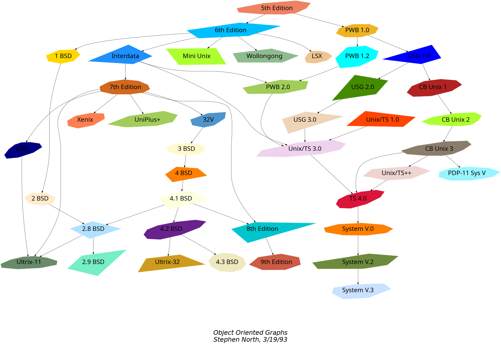
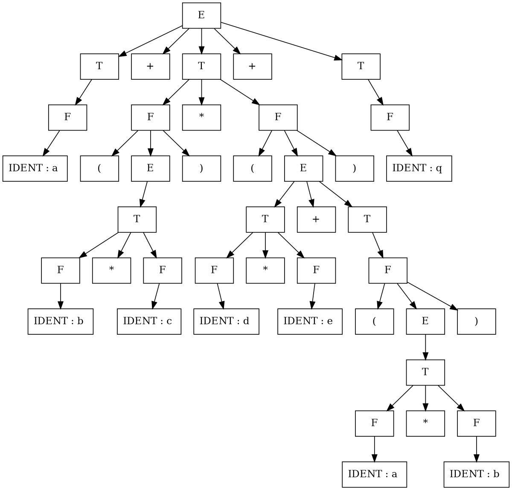
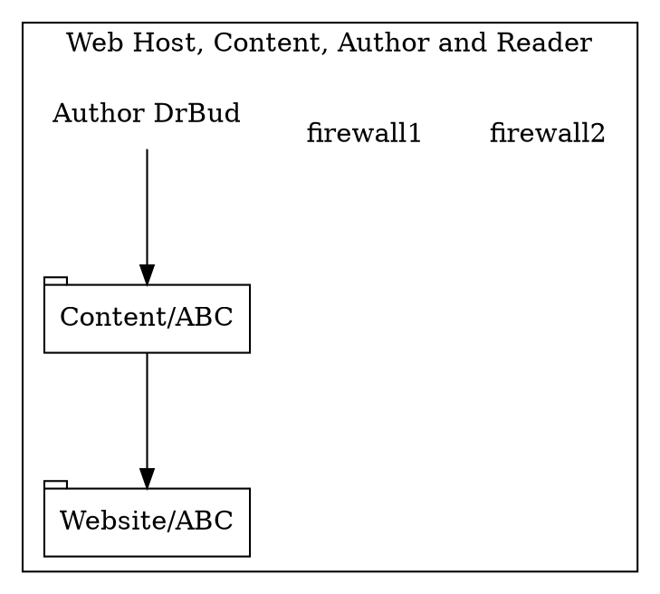

### Graphviz via `viz.js`

Smartdown has integrated the powerful [viz.js](https://github.com/mdaines/viz.js) library, which is compiled into Javascript from the original Graphviz C code.

Note: There is a similarly named package at [https://visjs.org](https://visjs.org) which Smartdown does not currently use.

There is a Graphviz example displaying the `stdlib` namespaces at [Stdlib via Graphviz](:@Stdlib)

#### Crazy.gv

#### Tree Example

#### Using Images

This needs better documentation. It is an early-stage feature still under development.

When Smartdown is initialized via `smartdown.initialize`, it is provided with a list of images that can be used with the SVG `/media` syntax (see [SVG](:@SVG) for more info). This same set of images is also made available to Graphviz via its `image:` attribute to nodes.

---

[Back to Home](:@Home)

