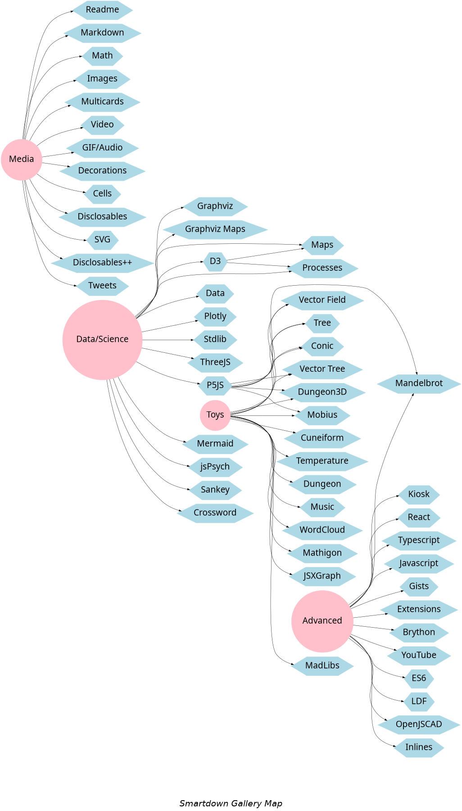
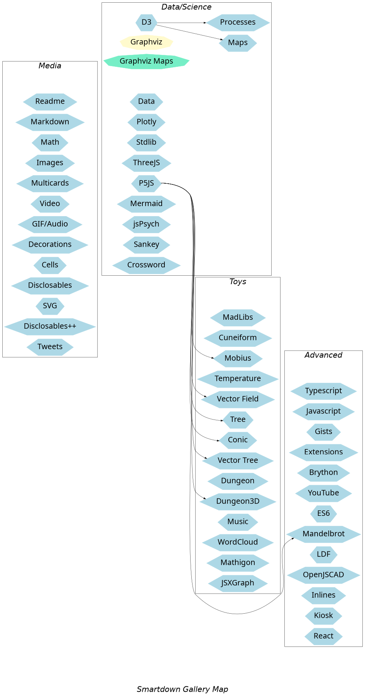

### Using GraphViz to create clickable navigation maps

This document explores the use of [viz.js](https://github.com/mdaines/viz.js), which provides Graphviz capability in the browser. Specifically, we explore the use of the `URL` attribute and the ability have clickable nodes, edges, and graphs.

#### Inline Diagrams with Clickable Nodes

The following example demonstrates the use of an *inline* Graphviz playable, and the use of the `URL` attribute to attach link behaviors to nodes.

- `URL=#README` will use Smartdown tunneling to load the `README.md` document
- `URL=#Markdown#philosophy` will load `Markdown.md`, and then go to the `philosophy` anchor within that document
- `URL=#GraphvizClickable#gallery-digraph-with-clusters` will go to the `gallery-digraph-with-clusters` anchor within this document.
- `URL=javascript:alert('You clicked Hello');` will put up a `Hello` alert
- `URL=javascript:smartdown.setVariable('Goodbye', true);` will set the Smartdown variable `Goodbye` to `true`, and a Javascript playable will react to this change by displaying `Goodbye` in its div.

Can we do inline graphviz? Let's see...

```graphviz/playable/autoplay/inline
digraph "unix" {
  rankdir=LR; // Left to Right, instead of Top to Bottom
  graph [
    size = "4,1",
  ];

  node [
    fontsize = 30,
    color = lightblue,
    style = filled,
  ];

  "Readme" [URL="#README"];
  "Markdown" [URL="#Markdown#philosophy"];
  "Math" [URL="#Math"];
  "Clustered Digraph" [URL="#GraphvizClickable#gallery-digraph-with-clusters"];

  "Readme" -> "Markdown";
  "Markdown" -> "Math";
  "Math" -> "Clustered Digraph";
}
```



and here is another one...

```graphviz/playable/autoplay/inline
digraph "unix" {
  rankdir=LR; // Left to Right, instead of Top to Bottom
  graph [
    size = "3,1",
  ];

  node [
    fontsize = 30,
    color = lightyellow,
    style = filled,
  ];

  "Hello" [URL="javascript:alert('Hello'); smartdown.setVariable('Goodbye', false);"];
  "Goodbye" [URL="javascript:smartdown.setVariable('Goodbye', true);"];
  "Hello" -> "Goodbye";
}
```


It appears that we can do inline Graphviz playables.

The `Goodbye` playable is below, and will react to changes in the `Goodbye` variable.

```javascript /playable/autoplay
this.dependOn.Goodbye = () => {
  this.div.innerHTML = env.Goodbye ? `<h1>Goodbye</h1>` : '';
};
```


#### Gallery Digraph

A first attempt at displaying the various Gallery examples in a more graphical format. Clicking on a node should tunnel to that node's content.



#### Gallery Digraph with Clusters

Here, I took the original Gallery table of examples and structured it using Graphviz clusters instead of table columns.



---

[Gallery Home](:@Home)
