### Inline Playables

Smartdown's playable mechanism enables a variety of interactive content to be embedded into a document. By default, a playable is displayed in the way that a typical *figure* or *graphic* might be displayed, as a *block* that is separated from its preceding and following text. But there are many examples where an *inline* playable would be useful.

This document explores Smartdown's attempts to make this a practical feature.

#### Inhibiting paragraph breaks

An early experiment with inlining playables relies up using special syntax to inhibit a paragraph's normal `display: block` policy and instead use an `display: inline` policy so that it abuts adjacent elements such as playables that have been annotated with `/inline`.

- Ordinarily, Smartdown text is formatted in *paragraphs*, which are rendered with `display: inline-block`, which is usually what you want.
- Smartdown playables are `display: block` by default, although the recently added `/inline` qualifier changes that to `inline-block`.
- In order to get a playable to *abut* a paragraph, we need to adjust the adjacent paragraphs' `display` to be `inline`, when it detects that the playable is marked `/inline`.


##### Simple Examples

Here is a P5JS circle:


```p5js/playable/autoplay/inline
p5.setup = function() {
};

p5.draw = function() {
  p5.ellipse(50, 50, 80, 80);
};
```

and here is a rectangle prefixed with math $E=mc^2$


```p5js/playable/autoplay/inline
p5.setup = function() {
};

p5.draw = function() {
  p5.rect(5, 5, 80, 80);
};
```

$E=mc^2$ and also suffixed with the same math.

So you can see how the circle and rectangle above were rendered inline with the text.


#### Inline Target Div

An alternative, and much more flexible, mechanism for adding inline playables is enabled by allowing Smartdown to create an *inline target div* easily, and then to reference that div in a subsequent playable. This allows the code that specifies an inline div's content to be placed elsewhere in the document source.

##### Animated Sparkline Example

This initial example will demonstrate an animated [sparkline](https://en.wikipedia.org/wiki/Sparkline) adapted from the example from [http://bl.ocks.org/benjchristensen/1148374](http://bl.ocks.org/benjchristensen/1148374).

First, we'll define a Javascript function `drawSparkline` which we will use in a few different contexts.

```d3/playable/autoplay
function drawSparkline(id, width, height, interpolation, animate, updateDelay, transitionDelay) {
  // create an SVG element inside the #graph div that fills 100% of the div
  var graph = d3.select(id).append("svg:svg");
  graph
    .attr("width", `${width}px`)
    .attr("height", `${height}px`);

  // create a simple data array that we'll plot with a line (this array represents only the Y values, X will just be the index location)
  var data = [3, 6, 2, 7, 5, 2, 1, 3, 8, 9, 2, 5, 9, 3, 6, 3, 6, 2, 7, 5, 2, 1, 3, 8, 9, 2, 5, 9, 2, 7, 5, 2, 1, 3, 8, 9, 2, 5, 9, 3, 6, 2, 7, 5, 2, 1, 3, 8, 9, 2, 9];

  // X scale will fit values from 0-10 within pixels 0-100
  var x = d3.scaleLinear().domain([0, 48]).range([-5, width]); // starting point is -5 so the first value doesn't show and slides off the edge as part of the transition
  // Y scale will fit values from 0-10 within pixels 0-100
  var y = d3.scaleLinear().domain([0, 10]).range([0, height]);

  // create a line object that represents the SVN line we're creating
  var line = d3.line()
    // assign the X function to plot our line as we wish
    .x(function(d,i) {
      // verbose logging to show what's actually being done
      //console.log('Plotting X value for data point: ' + d + ' using index: ' + i + ' to be at: ' + x(i) + ' using our xScale.');
      // return the X coordinate where we want to plot this datapoint
      return x(i);
    })
    .y(function(d) {
      // verbose logging to show what's actually being done
      //console.log('Plotting Y value for data point: ' + d + ' to be at: ' + y(d) + " using our yScale.");
      // return the Y coordinate where we want to plot this datapoint
      return y(d);
    })
    .curve(d3.curveBasis);

    // display the line by appending an svg:path element with the data line we created above
    graph.append("svg:path").attr("d", line(data));
    // or it can be done like this
    //graph.selectAll("path").data([data]).enter().append("svg:path").attr("d", line);


    function redrawWithAnimation() {
      // update with animation
      graph.selectAll("path")
        .data([data]) // set the new data
        .attr("transform", "translate(" + x(1) + ")") // set the transform to the right by x(1) pixels (6 for the scale we've set) to hide the new value
        .attr("d", line) // apply the new data values ... but the new value is hidden at this point off the right of the canvas
        .transition() // start a transition to bring the new value into view
        .ease("linear")
        .duration(transitionDelay) // for this demo we want a continual slide so set this to the same as the setInterval amount below
        .attr("transform", "translate(" + x(0) + ")"); // animate a slide to the left back to x(0) pixels to reveal the new value

        /* thanks to 'barrym' for examples of transform: https://gist.github.com/1137131 */
    }

    function redrawWithoutAnimation() {
      // static update without animation
      graph.selectAll("path")
        .data([data]) // set the new data
        .attr("d", line); // apply the new data values
    }

    setInterval(function() {
       var v = data.shift(); // remove the first element of the array
       data.push(v); // add a new element to the array (we're just taking the number we just shifted off the front and appending to the end)
       if(animate) {
         redrawWithAnimation();
       } else {
           redrawWithoutAnimation();
       }
    }, updateDelay);
}

window.drawSparkline = drawSparkline;
```

##### Sparkline playable that uses inline target div

The playable below will use the `/&div1` syntax to direct its rendering to the div in the next paragraph. We'll test Smartdown's playable progress bar feature, so you should see a blueish progress bar in place of where the inline playable will eventually appear. That is, until you click this checkbox... [](:Xdoit), whereupon the `doit` variable will be defined and the playable will continue. Toggling the checkbox will do the obvious thing.

This paragraph has an *inline target div* called `div1`. It's right here: [](:&div1) and uses the following syntax to specify that a Smartdown cell is to be created: `[](:&div1)`. This div can be populated by a playable that refers to DOM id `inline-target-div1`. Alternatively, the syntax `/&div1` can be added to the playable's definition, which will inhibit the normal creation of a playable div, and will ensure that `this.div` will refer to the targeted div `inline-target-div`.

As another test, we'll also make the playable itself `/inline`, so the play/stop button should appear inline right here ...


```d3 /playable/autoplay/inline/&div1
const targetDiv1 = this.div;

this.dependOn.doit = () => {
  if (env.doit) {
    this.div.innerHTML = '';
    drawSparkline(this.div, 300, 30, "basis", false, 1000, 1000);
  }
  else {
    this.div.innerHTML = '';
  }
};

```

... and this text should follow the play/stop button.

##### Sparkline playable that uses paragraph break inhibition

An early experiment with inlining playables relies up using special syntax to inhibit a paragraph's normal `display: block` policy and instead use an `display: inline` policy so that it abuts adjacent elements such as playables that have been annotated with `/inline`.

Check out my sparkline without break inhibition

```d3 /playable/autoplay/inline
drawSparkline(this.div, 300, 30, "basis", false, 1000, 1000);
```

Isn't it cool?


##### Non-Javascript Inline Playables

We can use the same inline div target mechanism for other playable languages, such as Mermaid or Graphviz.

Here's a little Graphviz diagram inlined into this paragraph right here ... [](:&graphviz1) ... and these words follow the graphic, which is defined in the playable below:

```graphviz/autoplay/playable/&graphviz1
digraph L0 {
  size = "2,2";
  ordering=out;
  node [shape = box];

  n0 [label="E"];
  n1 [label="T"];
  n2 [label="F"];
  n3 [label="IDENT : a "];
  n4 [label="+"];
  n5 [label="T"];
  n6 [label="F"];
  n7 [label="("];
  n8 [label="E"];
  n9 [label="T"];
  n10 [label="F"];
  n11 [label="IDENT : b "];
  n12 [label="*"];
  n13 [label="F"];
  n14 [label="IDENT : c "];
  n15 [label=")"];
  n16 [label="*"];
  n17 [label="F"];
  n18 [label="("];
  n19 [label="E"];
  n20 [label="T"];
  n21 [label="F"];
  n22 [label="IDENT : d "];
  n23 [label="*"];
  n24 [label="F"];
  n25 [label="IDENT : e "];
  n26 [label="+"];
  n27 [label="T"];
  n28 [label="F"];
  n29 [label="("];
  n30 [label="E"];
  n31 [label="T"];
  n32 [label="F"];
  n33 [label="IDENT : a "];
  n34 [label="*"];
  n35 [label="F"];
  n36 [label="IDENT : b "];
  n37 [label=")"];
  n38 [label=")"];
  n39 [label="+"];
  n40 [label="T"];
  n41 [label="F"];
  n42 [label="IDENT : q "];
  n0 -> { n1 n4 n5 n39 n40 };
  n1 -> n2 ;
  n2 -> n3 ;
  n5 -> { n6 n16 n17 };
  n6 -> { n7 n8 n15 };
  n8 -> n9 ;
  n9 -> { n10 n12 n13 };
  n10 ->  n11 ;
  n13 ->  n14 ;
  n17 ->  { n18 n19 n38 };
  n19 ->  { n20 n26 n27 };
  n20 ->  { n21 n23 n24 };
  n21 ->  n22 ;
  n24 ->  n25 ;
  n27 ->  n28 ;
  n28 ->  { n29 n30 n37 };
  n30 ->  n31 ;
  n31 ->  { n32 n34 n35 };
  n32 ->  n33 ;
  n35 ->  n36 ;
  n40 ->  n41 ;
  n41 ->  n42 ;
}
```




---

[Back to Home](:@Home)


