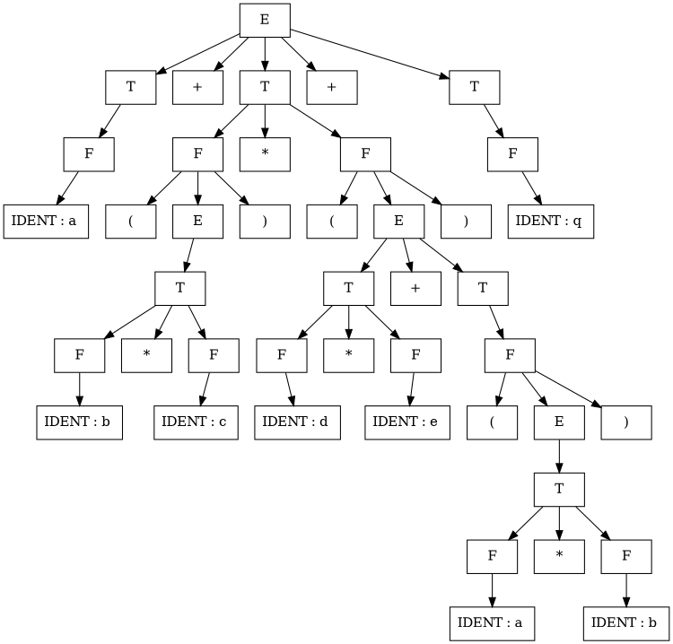

### Kiosk Mode Experiments

The idea of a *kiosk mode* for Smartdown has been on my mind for a while, but [WildThinks](https://wildthinks.org) has given me a really good use case in the way they are trying to teach Calculus via Smartdown. So this document presents an initial draft of how a *kiosk mode* works in Smartdown.


#### Why?

Some authors and readers prefer a *picture first* vs *words first* approach to teaching and learning. In order to help accommodate this, we've adapted Smartdown with a *kiosk mode* that enables a playable to use the entire `smartdown-outer-container` as its drawing area, but still allows for Smartdown-enabled content to be display via disclosables and other mechanisms.

We want to be able to *invert* the traditional text-to-app relationship for a project, where the first thing the reader sees is an interactive playable, and as they explore, text and details can be revealed via disclosables and *transitions*

*Transitions* are not yet implemented except in the form of whole-window tunnels; but the idea is one kiosk-mode playable can replace itself with another. Additionally, we can in theory support multiple concurrent kiosk playables if their transparency and `z-index` is controlled.


#### Basic spec
- A playable can be in its default mode, where drawing is ideally confined to the playable's `div`.
- A playable can be in its *kiosk* mode, where the `div` has been expanded to the full window area.
- The playable option `/kiosk` will cause a playable to be displayed in kiosk mode when it is played.
- An `autoplay` playable will enter kiosk mode immediately.
- There will be a `toggleKiosk` button placed in the playable area that will allow a user to toggle. Eventually, we might decide to make this toggle optional.

#### P5JS Bouncing Ball with Disclosable

The following Playable will adjust its P5JS div so that it takes up the entire window.

Clicking on the circle as it bounces around will toggle the visibility of a Smartdown disclosable.


# :::: aboutCircle
##### About the Circle

The [Circle](https://en.wikipedia.org/wiki/Circle) is described by the equations:

$$A = \pi r^2$$
$$C = 2 \pi r$$

---

**Fullscreen** [](:Xfullscreen)

# ::::

```javascript /playable/autoplay
smartdown.setVariable('fullscreen', smartdown.isFullscreen());
this.dependOn = ['fullscreen'];
this.depend = function() {
  if (env.fullscreen !== smartdown.isFullscreen()) {
    smartdown.setVariable('fullscreen', env.fullscreen);
  }
  if (env.fullscreen) {
    smartdown.openFullscreen();
  }
  else {
    smartdown.closeFullscreen()
  }
};

```

```p5js /playable/autoplay/kiosk
var div = this.div;
div.style.background = 'none';
div.style.width = '90%';
div.style.height = '90%';
div.style['min-height'] = '300px';
div.style.padding = 0;
div.style.margin = 'auto';

var x
var y
var xv = 15;
var yv = 15;
var buffer = 12;
var radius = 50;

p5.setup = function() {
  p5.frameRate(10);

  p5.noStroke();
  p5.windowResized();
};

p5.windowResized = function() {
  p5.resizeCanvas(div.clientWidth, div.clientHeight);
  x = p5.width / 2;
  y = p5.height / 2;
};

p5.draw = function() {
  if ((xv > 0 && x + radius + buffer >= p5.width) ||
  	  (xv < 0 && x <= radius + buffer)) {
    xv = -xv;
  }

  if ((yv > 0 && y + radius + buffer >= p5.height) ||
  	  (yv < 0 && y <= radius + buffer)) {
   	yv = -yv;
  }

  x += xv;
  y += yv;

  p5.fill(x % 255, y % 255, 200, 64);
  p5.ellipse(x, y, 2 * radius, 2 * radius);
};

p5.mousePressed = function() {
  var distance = Math.sqrt((p5.mouseX - x) * (p5.mouseX - x) + (p5.mouseY - y) * (p5.mouseY - y));
  if (distance < radius) {
    smartdown.toggleDisclosure('aboutCircle', '', 'center,closeable,draggable');
  }
}
```

### A GraphViz Playable in Kiosk Mode





---

[Back to Home](:@Home)

