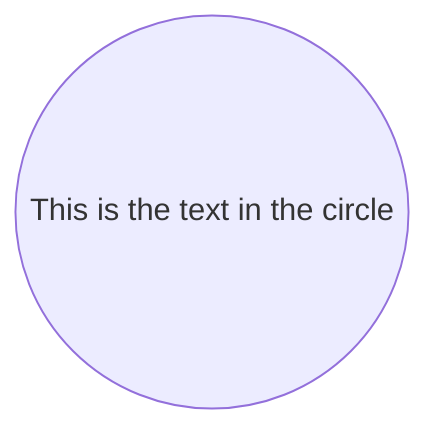
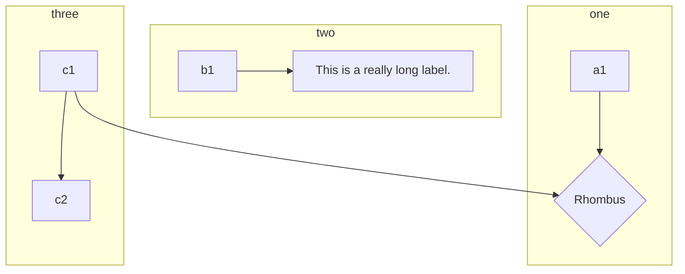
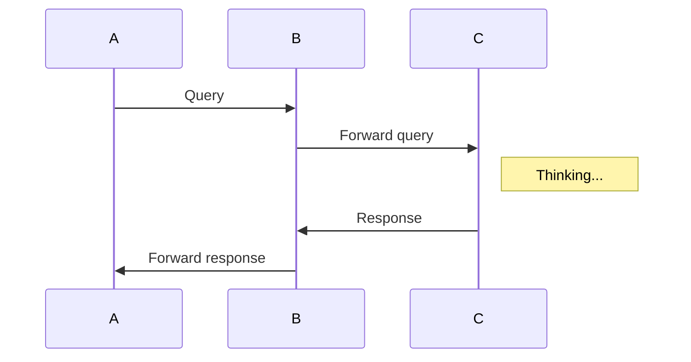
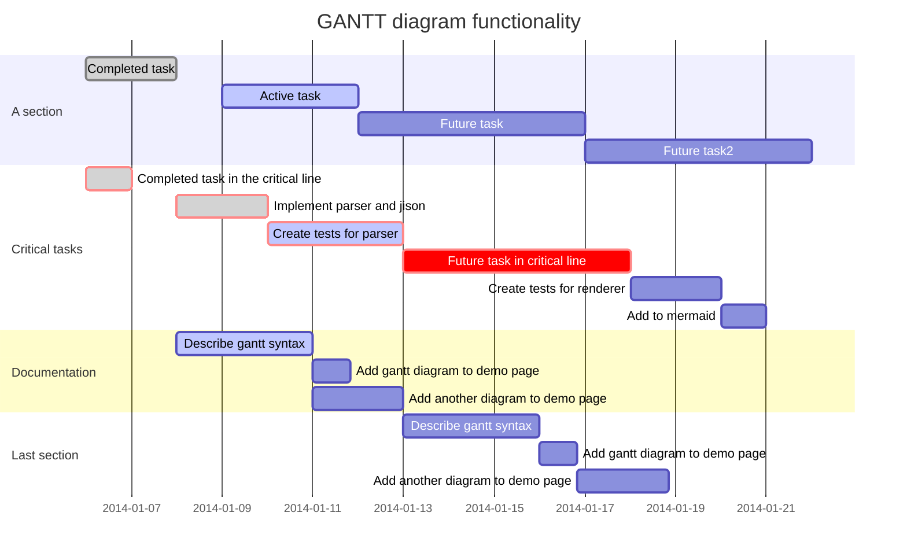

### Mermaid Examples

[Mermaid](https://mermaidjs.github.io) provides a concise and practical way to describe various technical diagrams and have them rendered within a web page. See [Mermaid Demos](https://mermaidjs.github.io/demos.html) for some of its capabilities.

Smartdown has integrated Mermaid, making it easier to mix Mermaid diagrams with Markdown and other Smartdown playables and content.

The examples below show some of the ways Mermaid may be used to help explain with diagrams.

---




#### Graph/Flowchart Diagram



#### Sequence Diagram



#### Gantt Diagram




#### Experimenting with dynamic Mermaid

A quick experiment that shows how a Smartdown cell (called `Name`, in this example) can be used as input to derive a dynamic Mermaid diagram which uses `Name`. In this example, if `Name` is blank, then `Alice` will be used as the name.

[What is your Name?](:?Name)

#### Here is your diagram, [](:!Name)

```javascript/playable
var actorName = env.Name;
if (!actorName || actorName.length === 0) {
   actorName = 'Alice';
}

var dynamicMermaidSource =
`
sequenceDiagram
    ${actorName}->>John: Hello John, how are you?
    John-->>${actorName}: I'm awesome, as are you, ${actorName}!
`;

smartdown.setVariable('MermaidSource', dynamicMermaidSource)
```

[](:!MermaidSource|mermaid)
[](:!MermaidSource|code)


---


[Back to Home](:@Home)

